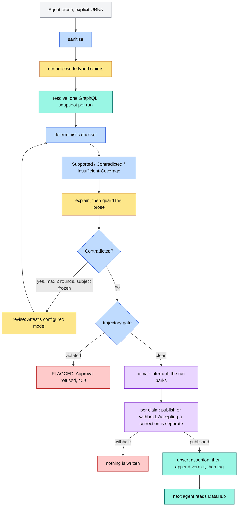
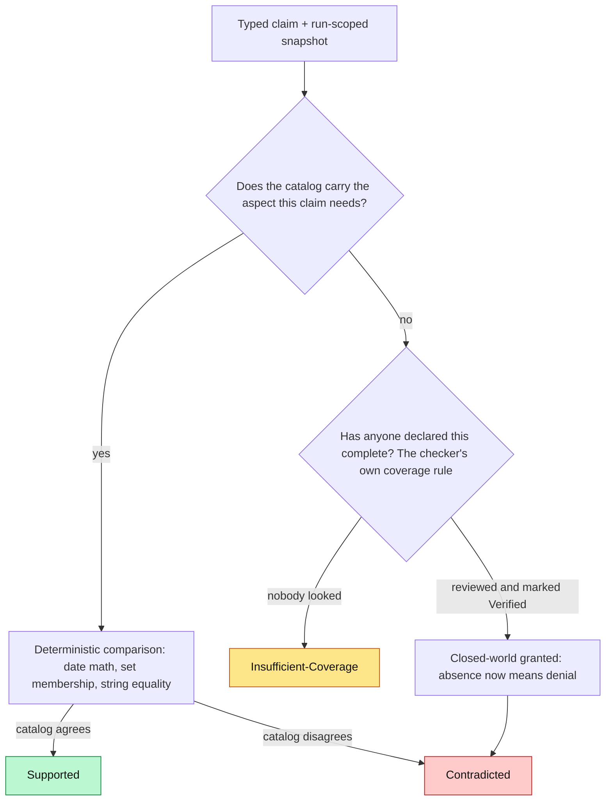
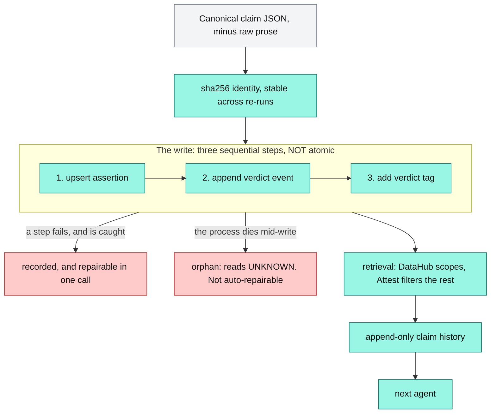

# Attest

**Verify what an AI agent says about your data — and publish the per-claim verdict to DataHub, so the next agent inherits it.**

Deterministic verdicts. Unknown is not false. Human-gated publication. Append-only claim history in DataHub.

[](https://github.com/Asembris/Attest/actions/workflows/ci.yml)
[](LICENSE)
[](pyproject.toml)
[](docs/datahub-setup.md)

An agent claims *"the `customer_profile` table contains no PII."* Attest checks that claim against
DataHub, reaches a verdict in code, asks a human whether to publish it, and — on approval — writes it
back as a **claim artifact addressed to that exact proposition**. The next agent asks DataHub, not us.

| | | | |
| --- | --- | --- | --- |
| **0** verdicts decided by a model | **3** explicit verdicts | **1** content-addressed artifact per proposition | **DataHub-only** inheritance ([limits](#scope-and-limitations)) |

*(0 is an architectural invariant asserted on every run — not a measured accuracy. See [why the verdict is trustworthy](#why-the-verdict-is-trustworthy).)*

**→ [Inspect the benchmark receipts](benchmark/README.md)** · [What the next agent inherits](#what-the-next-agent-inherits) · [Why GraphQL, not MCP?](#why-graphql-not-mcp)

## The audited transaction



<sub>**Amber** = model-assisted · **Blue** = deterministic code · **Purple** = human decision · **Teal** = DataHub · **Red** = a stop.</sub>

Two things this diagram is careful about. **`POST /audit` writes nothing to the catalog, ever** — the
only path to a write is a human publishing a parked run. And the three DataHub writes are
**sequential, not atomic**: they are drawn as three steps because that is what they are, and the
[limits](#scope-and-limitations) say what happens when one fails.

## What the next agent inherits

This is the half of the thesis that is easy to fake. An agent says:

> "The `customer_profile` table contains no PII."
> `urn:li:dataset:(urn:li:dataPlatform:snowflake,analytics.customers.customer_profile,PROD)`

The table is tagged `PII`. The verdict is **Contradicted**. A human publishes it, and DataHub gains an
artifact whose identity **is** the claim — the URN below is the one this exact claim really hashes to:

```
urn:li:assertion:attest-a6016c69300d32bf5a0a    # sha256 over the canonical claim, minus its prose
  customType : ATTEST_CLAIM_CLASSIFICATION      # filterable
  grain      : table
  runEvents  : [ Contradicted @ t1, ... ]       # append-only; a re-audit adds, never overwrites
  tag        : urn:li:tag:Attest-Contradicted   # a projection, written last
```

Three properties that fall out of content-addressing, and each is load-bearing:

- **Two claims about one dataset coexist.** They hash differently, so they land at different URNs.
  A dataset-level verdict field cannot do this — the second claim overwrites the first, and the
  survivor is a verdict with no subject. That was the defect this design was built to fix.
- **Re-phrasing the sentence does not mint a second artifact.** `raw_text` is excluded from the
  identity, so *"customer_profile is PII-free"* is the same claim, and its verdict **appends** to the
  same history. Verified against the shipped code, not asserted here.
- **Re-running the write is safe.** The id is derived from the claim and nothing else — no run id, no
  clock — so a retry lands on the same artifact rather than duplicating it.

Retrieval reads **DataHub**, never Attest's database: `GET /claims`, `GET /claims/{claim_urn}`. A
reader constructed with no store at all (`ClaimReader(client, store=None)`) gets every claim, verdict,
reviewer and history out of the catalog alone — which is the actual test that the knowledge was
inherited rather than merely recorded. It paginates, so nothing is silently past a cap; and an
Insufficient-Coverage verdict's evidence round-trips as **absence** — a `null` that stays `null`, never
collapsed to empty — because for that verdict the catalog's silence *is* the evidence. What such a
reader *cannot* do is diagnose a half-finished write; see [limits](#scope-and-limitations).

## Three verdicts, not a binary guess



| Verdict | Meaning | One example |
| --- | --- | --- |
| **Supported** | The catalog affirms the claim. | `customer_profile` is owned by alice.chen, and the claim says so. |
| **Contradicted** | The catalog positively disagrees. | `revenue_daily` was last modified 417 days ago; the claim says "updated daily". |
| **Insufficient-Coverage** | The catalog is silent. Absence, not disagreement. | `raw_events` has no owner at all, so "Bob owns it" is unverifiable — not false. |

Keeping the third distinct from the second is the whole point. An auditor that reads *"the catalog
doesn't say"* as *"the agent is wrong"* cries wolf on every under-documented table — which is most of
them. Attest never assumes closed-world reasoning; the **catalog grants it per entity**, via a
`Verified` marker a human applied. That is why the diagram has two ways to reach Contradicted, and why
*"PII-free"* is not the mirror image of *"contains PII"*: an untagged table cannot **support** a
PII-free claim, because nobody looked.

The governance rules behind that branch — which signals count as PII, and how they resolve when they
disagree — are declared as reviewable data in
[`checkers/policy.py`](src/attest/checkers/policy.py), not buried in an `if`. See
[docs/architecture.md](docs/architecture.md#how-attest-decides-what-is-pii).

## Receipts, not headlines

Every number here is a committed JSON artifact you can open. None is typed by hand.

| Receipt | What it records | Where |
| --- | --- | --- |
| **Deterministic core**, 40 cases | accuracy **1.0**, macro-F1 **1.0**, **0** correctness failures, **0** coverage failures, **pass@5 = 1.0** | [`core.json`](benchmark/results/core.json) · `just bench` |
| **Full pipeline**, prose in, 40 cases | accuracy **1.0**, macro-F1 **1.0**, **40/40** model-authored explanations, **0** template fallbacks, **0** guard rejections, **$0.0138309**, pass@3 = 1.0 | [`full.json`](benchmark/results/full.json) · `just bench-full` |
| **Sabotage** — one checker broken on purpose | accuracy **0.675**, macro-F1 **0.668**, Supported precision **0.536**, **13** errors named | [`core-sabotaged-classification.json`](benchmark/results/core-sabotaged-classification.json) · `just bench-sabotage` |
| **Cross-family labels** (Nemotron, Llama family) | **39/40 agreement (97.5%)**, 1 disputed | [`calibration.json`](benchmark/results/calibration.json) · `just bench-calibrate` |

**100% is a conformance gate, not a capability score — and it must be read that way.** The checkers are
deterministic code implementing exactly the rules the labels encode, so anything below 100% is a *bug*,
not a difficulty signal. The benchmark is a regression net and a coverage proof. That is why the
sabotage row matters more than the first: break one checker and the metrics collapse, which is the only
evidence that they measure anything at all. It runs on every `just check`, not just on demand.

**pass@k is a bug detector, not a score.** A deterministic checker cannot return two answers, so
pass@5 below 100% on the core would mean a model had leaked into the verdict path.

**What the benchmark does not prove**, stated plainly because omitting it is what would make the 100%
hollow: it runs against a **seeded** catalog, not a messy real one; the labels **apply** the policy and
do not **validate** it (a wrong rule scores 100% while being wrong); and the catalog is both oracle and
input, so it cannot tell you whether the catalog is right about the **data**. Full methodology and
denominators: [`benchmark/README.md`](benchmark/README.md).

## Try it

Runs on your machine, not a hosted URL — **DataHub Core is a multi-container stack**, and a
per-machine instance is what makes each run's catalog its own (the reset story in
[docs/deployment.md](docs/deployment.md)). Two honest paths.

**Offline verification** — no DataHub, no API key, no cost. This is what CI runs:

```bash
just setup
just check          # lint + the truly-offline tier, on captured fixtures. Never skips.
```

**The local DataHub demo** — needs Docker (~8 GB free) and `OPENAI_API_KEY` for the semantic
layer:

```bash
just up             # bring up DataHub Core v1.5.0.6 from the vendored, pinned compose
just seed           # generate + ingest the seed catalog, capture the offline fixtures
just demo           # build the UI and serve it with the API on :8003
```

`just up` is a real command now, not a manual stack to set up by hand — it brings up DataHub
from a **vendored** compose (no GitHub fetch) and blocks until GMS is actually healthy.
**First bring-up pulls ~12.6 GB of images and takes a few minutes; the cold boot after that is
~4.5 min** ([measured](docs/deployment.md#measured-cost)). Then open `http://localhost:8003`,
`POST /audit` some agent prose, publish a verdict at the checkpoint, and read it back with `GET
/claims`.

`just smoke` makes "one command runs everything" **falsifiable**: it brings the stack up and
asserts the demo path answers, and `just smoke-sabotage` proves it goes red — at the wire — for
a dead stack and a dead demo path. `just reset` is the operator's definitive catalog wipe. The
version pin and environment landmines are in [docs/datahub-setup.md](docs/datahub-setup.md);
the deployment shape, the reset design, and the measured numbers are in
[docs/deployment.md](docs/deployment.md).

## Why the verdict is trustworthy

The claim is narrow and mechanical: **no model decides a verdict.** Freshness, ownership,
classification and schema verdicts come from date math, set membership and string comparison.
`checkers/` imports no model client, and a test asserts that.

What holds it up in practice:

- **The trajectory gate.** Every step records what kind it is (`deterministic` / `llm` / `io`) plus its
  token spend. The kind is what a step *claims* about itself; the token count is the *evidence* that
  checks it — so a checker that quietly started calling a model fails the run even if it returns the
  right answers. A violating run is `FLAGGED` and **cannot be approved** (HTTP 409), so a report the
  pipeline could not vouch for can never reach the catalog. Seven invariants, and
  [tests](tests/test_trajectory.py) sabotage the real pipeline four ways to prove they fire.
- **One snapshot per run.** Every claim in an audit is decided against a single frozen read of the
  catalog. Without it, two claims about one dataset can be checked against two different states of the
  world and the report contradicts itself while each verdict is individually "correct".
- **The prose is guarded, and the guard is finite.** Explanations pass three gates — crosscheck,
  lexical faithfulness, polarity — and any failure ships a **deterministic template** instead. The
  precise invariant, and no more: *a detected polarity contradiction cannot ship as model prose, and
  the deterministic verdict remains authoritative regardless.* These are lexical detectors. They do
  not prove arbitrary natural-language entailment, and this README does not claim they do.
- **Revision cannot change the subject.** A Contradicted claim may be revised — by **Attest's own
  configured model**, not by a callback into the original agent — at most twice, and the revision is
  re-checked by the same checker against the same snapshot. It may change what a claim *asserts*, never
  what it is *about*. Some claims are therefore honestly unrevisable, and standing by a false claim is
  still publishable.

Depth on all of it: [docs/architecture.md](docs/architecture.md).

## DataHub integration



<sub>The **run event** is the verdict and is append-only. The **tag** — and the dataset badge — are
projections written after it, never the truth. Retrieval paginates and round-trips the catalog's total,
so a claim past the page is named as truncated, never silently absent.</sub>

**Reads are GraphQL over `httpx`.** Writes are three sequential operations, and each is idempotent —
which is why repeating the write *is* the recovery, and why no saga is needed. `WriteResult` names the
**step** that failed rather than returning a boolean, because a failed `report` leaves a claim with no
verdict while a failed `tag` leaves a verdict that is correct and merely not findable by search. Those
are different problems, and `POST /audit/{run_id}/writeback` repairs both from the stored record
without approving anything.

**Where each filter is applied is part of the answer.** The two server-side entry points are disjoint:
`dataset.assertions` scopes to a dataset but filters nothing; `searchAcrossEntities` filters `verdict`
and `claim_type` but scopes to nothing. `reviewer` and `since` can never be pushed down — an assertion
indexes nothing else — so they are applied **locally, after a bounded read**. Every response reports
this rather than letting a caller assume the catalog answered what Attest answered. *Retrievable from
DataHub* is true; *fully queryable in DataHub* is false, and the API says so on every call.

### Why GraphQL, not MCP?

Challenge 1 names the DataHub MCP Server as how agents get catalog context, so it was scoped, built
against, and **measured** — not skipped. The server runs fine against Core; compatibility was never the
wall. The wall is that its read tools are built to feed a *language model*, and each optimisation for
that purpose destroys something a checker needs: a dataset's `lastModified` is requested by no tool,
and field tags are flattened to display names (`urn:li:tag:PII` → `"PII"`), so a column's term can no
longer reach the glossary hierarchy that makes it a signal.

**Measured on `mcp-server-datahub` 0.6.0 against the pinned Core: parity fails on 16/16 seeded datasets
(130 field mismatches), and four of five true claims change verdict — including
`customer_profile.email is PII` reading back Contradicted.** That last one is a *correctness* failure,
the worst thing this product can do, and it is Attest's own thesis biting Attest: the tag arrives
unrecognisable, the column reads unlabelled, the table is `Verified`, and our own completeness rule
turns the loss into a **denial**. A transport that is lossy for an LLM is not merely lossy for a
checker — it is *inverting*.

So MCP was rejected for deterministic verdict reads, on evidence. `just spike-mcp` **exits non-zero by
design**: if it ever goes green, the finding has expired and the decision is worth reopening. Full
write-up, per-dataset diffs, and three defects drafted for upstream:
**[docs/mcp-evaluation.md](docs/mcp-evaluation.md)**.

## API

Seven routes. `just serve`, then [localhost:8003/docs](http://localhost:8003/docs) for the generated,
always-current reference.

| Route | What it does |
| --- | --- |
| `GET /health` | Attest's liveness, and the catalog's, reported separately. |
| `POST /audit` | Audit an agent's output. Returns verdicts, evidence, receipts. **Writes nothing to the catalog.** |
| `GET /audit/{run_id}` | A stored audit, whole. |
| `POST /audit/{run_id}/approve` | The human checkpoint. Per claim: `publish` and `accept_correction`, independently. |
| `POST /audit/{run_id}/writeback` | Repair a partial catalog write from the stored record. Approves nothing. |
| `GET /claims` | Published claims, **read from DataHub**. Reports where each filter was applied. |
| `GET /claims/{claim_urn}` | One claim artifact and its whole append-only verdict history. |

**Every audited claim parks for a human decision, whatever its verdict** — and `publish` is separate
from `accept_correction`, because "your claim was wrong, and the fix you proposed is also wrong" is a
thing a reviewer needs to be able to say. Omitting a field means *no opinion*: the claim stays pending
and the run stays parked, decidable later. There is no `?auto_approve=true` and no "approve all".

> An auditor that silently rewrites what it audits has stopped being an auditor.

## Testing

| Tier | Needs | Side effects | Command |
| --- | --- | --- | --- |
| **Offline** — checkers, benchmark, coverage matrix, guards, graph, API | Nothing. Captured fixtures. | None. Free. **Never skips; gates CI.** | `just check` |
| **Integration** — the GraphQL client against a real GMS | DataHub Core running | Reads only | `just test` |
| **Live** — the semantic layer vs a real model, plus the anti-drift fixture pin | DataHub + `OPENAI_API_KEY` | **Spends tokens; writes to your local catalog** | `just live` |
| **Browser E2E** — a real browser drives the whole transaction to DataHub and back | ...plus a built UI | As above, through real Edge | `just e2e` |

The two halves are blind to each other's failure mode, which is why running both is a rule rather than
a habit: `just check` proves the guard still catches hallucinations — a guard that rejected
*everything* would pass it perfectly — while `just live` proves it still lets the truth through.
`just preflight` runs all three and is the convention before any push touching a prompt. See
[CONTRIBUTING.md](CONTRIBUTING.md).

The offline tier is date-stable by construction: the test clock is derived from the captured fixture,
not the wall clock, so freshness verdicts cannot rot into red against correct code. The fixtures are
exactly as honest as [`test_fixture_drift.py`](tests/test_fixture_drift.py), which re-fetches every
seeded URN from live GMS and fails by name when one has moved — in the live tier.

## Scope and limitations

**Deliberate scope cuts.** Each is a place Attest declines to answer rather than guessing, because a
wrong verdict has the same confident shape as a right one.

- **Claims carry explicit URNs.** Free-text entity resolution ("the customer table" → a URN) is out of
  scope, so a resolution error can never be laundered into catalog disagreement.
- **There is no `attest.confidence`.** The verdicts are code; there *is* no confidence. The third
  verdict already carries the only uncertainty in the system. A `0.95` would be a number invented to
  look like an ML system — the precise thing this project exists to catch.
- **Reads are GraphQL, not MCP** — [measured](#why-graphql-not-mcp), not assumed.
- **Ownership *type*** (technical vs business vs steward) is ignored, and **cross-dialect type
  equivalence** (`int8` ~ `BIGINT`) is not attempted. Both need a schema change or a model of each
  platform's type system, not an `if`.

**Actual gaps.** Real, and not softened:

- **Local, not hosted, and no authentication.** Bring-up is one command (`just up`, from a
  vendored pinned compose), but it runs on your machine — there is no public URL to click, and
  that is the [deliberate reset design](docs/deployment.md#the-reset-design), not a gap. It
  needs Docker and ~8 GB free RAM, and the first bring-up pulls ~12.6 GB of images.
- **The three catalog writes are sequential, not atomic.** A caught failure is recorded, surfaced, and
  repairable in one call. But if the **process dies** after DataHub commits the upsert and before the
  outcome is persisted, nothing local knows a write was attempted: the claim reads `unknown`, and the
  repair endpoint cannot find it. `unknown` is deliberately **not** reported as a failure — no evidence
  of a write is not evidence of a failed write.
- **A stale verdict tag has no *background* reconciler.** A crash between `report` and `tag` leaves a
  correct verdict that a tag-filtered search cannot find. It is recorded, repairable in one call, and
  now **detected on read** — from the artifact alone, so a reader with no Attest store sees it too
  (`GET /claims` reports `stale_tag`). What is still deferred is a background sweeper that scans the
  catalog for stale tags unprompted.
- **The append-only verdict history has one collision boundary.** A retry does not double-count and a
  real re-audit appends — both pinned against live DataHub. But two *distinct* runs that share a
  start-millisecond and *disagree* collapse to one event: the timeseries key is `timestampMillis` and
  DataHub exposes no other, so run identity cannot enter it. It is unreachable in practice — two runs
  disagree only if the catalog changed between them, which cannot happen inside one millisecond — and
  is [documented, not papered over](docs/architecture.md#the-append-only-history-and-its-one-collision-boundary).
- **The browser E2E covers one path, not the UI.** `just e2e` drives a real browser through
  the whole transaction — audit, publish, three catalog writes, read back out of DataHub —
  and `just e2e-sabotage` proves it goes red by re-introducing two bugs that really shipped.
  It is the demo path and the repair path; it is not UI coverage, and the rest of the UI is
  still exercised by hand.
- **No store migrations.** A database older than the current schema is refused at open, by name:
  `rm attest.db attest-checkpoints.db` and re-run. Both are gitignored dev state; DataHub is untouched.
- **Not built:** continuous monitoring, multi-tenancy, bulk publication. A real deployment at the
  projected workload needs a policy layer for bulk publication; this is a hackathon build with a human
  checkpoint on every claim, and it says so rather than shipping an escape hatch.

## Documentation

| | |
| --- | --- |
| [benchmark/README.md](benchmark/README.md) | The golden benchmark: 40 hand-labeled claims, methodology, denominators, and why not RAGAS/DeepEval. |
| [docs/architecture.md](docs/architecture.md) | Trust boundaries, the PII policy, the graph, the guards, resume, and the cost projection. |
| [docs/deployment.md](docs/deployment.md) | The deployment shape, the reset design, the measured bring-up numbers, and the smoke test. |
| [docs/mcp-evaluation.md](docs/mcp-evaluation.md) | The measured MCP-vs-GraphQL finding, per-dataset. |
| [docs/datahub-setup.md](docs/datahub-setup.md) | The version pin, the seed, and the environment landmines. |
| [docs/design/claim-artifact.md](docs/design/claim-artifact.md) | The claim-artifact design, and the probe it was measured against. |
| [CONTRIBUTING.md](CONTRIBUTING.md) | Commands, the test tiers, and the verification cadence. |
| [CLAUDE.md](CLAUDE.md) | The full engineering log: every invariant and why it exists. |

Built solo for the DataHub Agent Hackathon. Licensed under [Apache-2.0](LICENSE).
