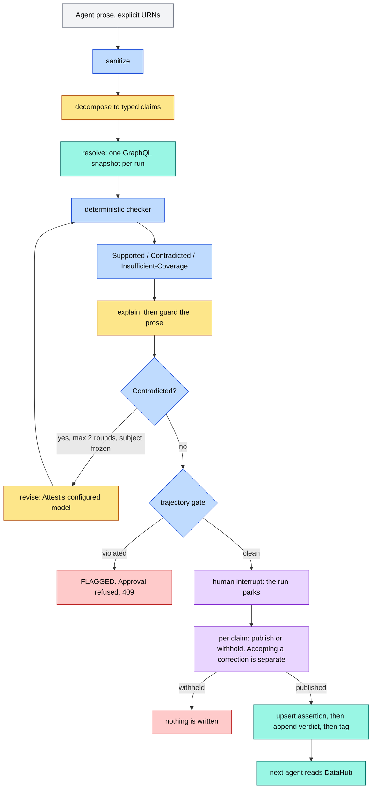
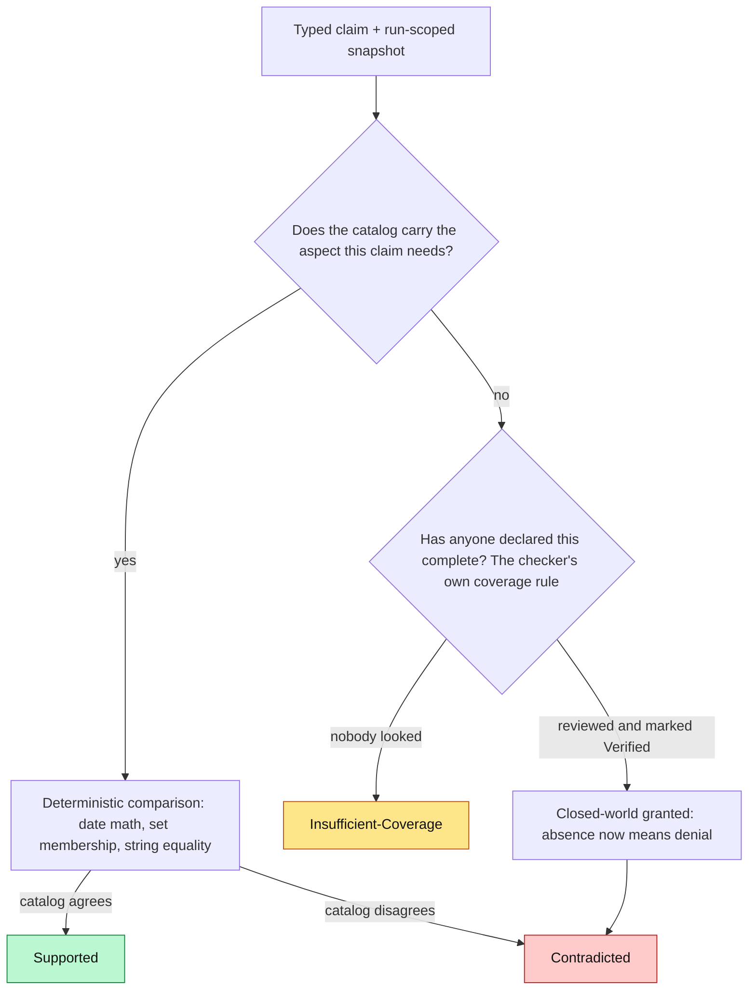
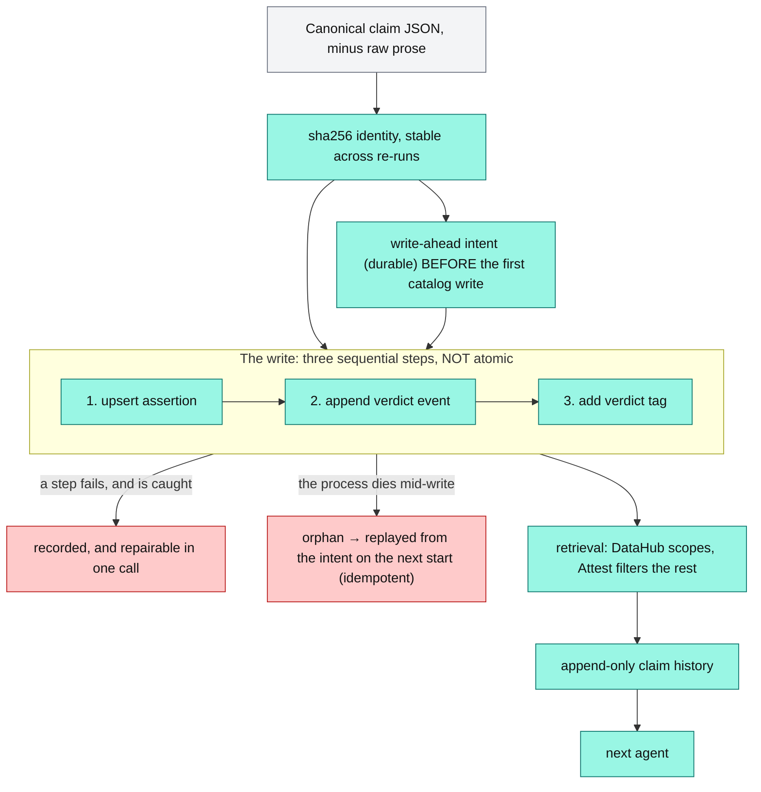

# Attest

**Attest verifies what an AI agent claims about your data — with zero verdicts decided by a
model — and publishes each verdict back into DataHub, so the next agent inherits it from the
catalog, not from Attest.**

[](https://github.com/Asembris/Attest/actions/workflows/ci.yml)
[](#why-the-verdict-is-trustworthy)
[](#receipts-not-headlines)
[](#engaging-with-the-mcp-server)
[](docs/datahub-setup.md)
[](pyproject.toml)
[](LICENSE)

An agent is asked to summarise a warehouse for a governance review. It writes: *"`customer_profile`
holds no PII."* Nobody checks it — there is nothing to check it *against* — and the sentence goes
into the report.

The table is tagged `PII`. Its `email` column is tagged `PII`. The catalog said so the whole time.

That is one failure. The one underneath it is worse: the next table the agent looks at has **no tags
at all**, and *"we reviewed it and it's clean"* is indistinguishable from *"nobody has ever looked."*
A tool that reports those two as the same thing will cry wolf on every under-documented table in the
warehouse — which is most of them.

> **Attest reads and writes DataHub Core v1.5.0.6.** It reads the catalog as ground truth over
> GraphQL, decides in code, and — once a human publishes — writes each verdict back as its own
> content-addressed **claim artifact** with an append-only verdict history.
>
> **The DataHub MCP Server was engaged, not skipped.** We built an adapter to its one-method
> seam, ran it against all 16 seeded datasets on the pinned Core, and measured what its
> responses can and cannot carry — `just spike-mcp` runs it against your own catalog. The
> measurement kept the verdict read on GraphQL, and produced three upstream issue drafts with
> reproductions. [The evaluation](#engaging-with-the-mcp-server).

## Zero, and what happens when we sabotage it

**No model decides a verdict in Attest.** Freshness, ownership, classification and schema verdicts
come from date math, set membership and string comparison. That is an architectural invariant
asserted on every run, not a measured accuracy — and it is checked three ways, including a gate that
**flags a run un-approvable** if any verdict step so much as spends a token
([how](#why-the-verdict-is-trustworthy)).

An invariant nobody can falsify is decoration. So: **break one checker on purpose and accuracy over
the 40-case benchmark falls from 1.000 to 0.675, Supported precision to 0.536, with 9 correctness
and 4 coverage failures named**
([receipt](benchmark/results/core-sabotaged-classification.json)). That check runs on every
`just check`, not on demand.

**→ [What the next agent inherits](#what-the-next-agent-inherits)** ·
[Engaging with the MCP Server](#engaging-with-the-mcp-server) ·
[Inspect the benchmark receipts](benchmark/README.md) ·
[Scope and limitations](#scope-and-limitations)

## What the next agent inherits

This is the half of the thesis that is easy to fake. An agent says:

> "The `customer_profile` table contains no PII."
> `urn:li:dataset:(urn:li:dataPlatform:snowflake,analytics.customers.customer_profile,PROD)`

The table is tagged `PII`. The verdict is **Contradicted**. A human publishes it, and DataHub gains
an artifact whose identity **is** the claim — the URN below is the one this exact claim really
hashes to:

```
urn:li:assertion:attest-a6016c69300d32bf5a0a    # sha256 over the canonical claim, minus its prose
  customType : ATTEST_CLAIM_CLASSIFICATION      # filterable
  grain      : table
  runEvents  : [ Contradicted @ t1, ... ]       # append-only; a re-audit adds, never overwrites
  tag        : urn:li:tag:Attest-Contradicted   # a projection, written last
```

Two properties fall out of content-addressing, and both are load-bearing:

- **Two claims about one dataset coexist.** They hash differently, so they land at different URNs.
  A dataset-level verdict field cannot do this — the second claim overwrites the first, and the
  survivor is a verdict with no subject. That was the defect this design was built to fix.
- **Re-running the write is safe.** The id is derived from the claim and nothing else — no run id,
  no clock — so a retry lands on the same artifact rather than duplicating it. (Re-phrasing the
  sentence doesn't mint a second artifact either; see
  [the design](docs/design/claim-artifact.md).)

**The proof is a reader with no Attest database.** Retrieval reads **DataHub**, never Attest's store
— `GET /claims`, `GET /claims/{claim_urn}` — and the same reader can be constructed with no store at
all:

```python
reader = ClaimReader(client, store=None)      # no Attest database, at all
page   = reader.list(ClaimQuery(target_urn=dataset_urn))

for c in page.claims:
    c.artifact.claim_urn            # urn:li:assertion:attest-a6016c69300d32bf5a0a
    c.artifact.claim_type           # 'classification'   (c.artifact.grain -> 'table')
    c.artifact.verdict              # 'Contradicted' — the STORED verdict, never inferred
    c.artifact.history              # every verdict it has ever had, append-only
    c.artifact.history[-1].reviewer # who published it, and on what evidence
    c.stale_tag                     # derived from the artifact alone
```

Every claim, verdict, reviewer and full history comes out of the catalog alone. That is the actual
test that the knowledge was **inherited** rather than merely recorded, and it runs live
([`test_live.py`](tests/test_live.py)).

Three details keep that read honest. The listing **paginates and round-trips the catalog's total**,
so a claim past the read cap is *named* as truncated rather than silently absent. An
Insufficient-Coverage verdict's evidence round-trips as **absence** — a `null` that stays `null`,
never collapsed to empty — because for that verdict the catalog's silence *is* the evidence. And a
**stale verdict tag is detected from the artifact alone**, so a store-less reader sees it too. What
such a reader *cannot* do is diagnose a half-finished write; see [limits](#scope-and-limitations).

## Why the verdict is trustworthy

The claim is narrow and mechanical: **no model decides a verdict.** `checkers/` imports no model
client, and takes a typed claim plus a catalog snapshot — it never sees agent text at all.

But "the source doesn't import it" is only as good as the next commit, so it is not what the
guarantee rests on. **Every step records what kind it is (`deterministic` / `llm` / `io`) alongside
its token spend. The kind is what a step *claims* about itself; the token count is the *evidence*
that checks it** — so a checker that quietly started calling a model fails the run even if it
returns the right answers. Concretely:

- [`tests/test_graph.py`](tests/test_graph.py) pins the checker step at **zero tokens**, and pins a
  run's model calls to decomposition and explanation *and nothing else*.
- [`tests/test_trajectory.py`](tests/test_trajectory.py) sabotages the real pipeline four ways —
  guard torn out, a checker that spends tokens, a correction proposed without re-verification, a
  miswired router — and every other test stays green through all four.
- A violating run is **`FLAGGED`** and **cannot be approved** (HTTP 409), so a report the pipeline
  could not vouch for never reaches the catalog. Seven invariants, of which
  `no-llm-in-the-verdict-path` is the load-bearing one.



<sub>**Amber** = model-assisted · **Blue** = deterministic code · **Purple** = human decision ·
**Teal** = DataHub · **Red** = a stop. **`POST /audit` writes nothing to the catalog, ever** — the
only path to a write is a human publishing a parked run — and the three DataHub writes are
**sequential, not atomic**, drawn as three steps because that is what they are.</sub>

Three more things hold it up in practice:

- **One snapshot per run.** Every claim is decided against a single frozen read of the catalog.
  Without it, two claims about one dataset get checked against two different states of the world and
  the report contradicts itself while each verdict is individually "correct".
- **The prose is guarded, and the guard is finite.** Explanations pass three gates — crosscheck,
  lexical faithfulness, polarity — and any failure ships a **deterministic template** instead. The
  precise invariant, and no more: *a detected polarity contradiction cannot ship as model prose, and
  the deterministic verdict remains authoritative regardless.* These are lexical detectors; they do
  not prove arbitrary natural-language entailment, and this README does not claim they do.
- **Revision cannot change the subject.** A Contradicted claim may be revised — by **Attest's own
  configured model**, not a callback into the original agent — at most twice, and re-checked by the
  same checker against the same snapshot. It may change what a claim *asserts*, never what it is
  *about*. Some claims are therefore honestly unrevisable, and standing by a false claim is still
  publishable.

Depth on all of it: [docs/architecture.md](docs/architecture.md).

## Three verdicts, not a binary guess



| Verdict | Meaning | One example |
| --- | --- | --- |
| **Supported** | The catalog affirms the claim. | `customer_profile` is owned by alice.chen, and the claim says so. |
| **Contradicted** | The catalog positively disagrees. | `revenue_daily` was last modified 417 days ago; the claim says "updated daily". |
| **Insufficient-Coverage** | The catalog is silent. Absence, not disagreement. | `raw_events` has no owner at all, so "Bob owns it" is unverifiable — not false. |

Attest never assumes closed-world reasoning; the **catalog grants it per entity**, via a `Verified`
marker a human applied. That is why the diagram has two ways to reach Contradicted, and why
*"PII-free"* is not the mirror image of *"contains PII"*: an untagged table cannot **support** a
PII-free claim, because nobody looked.

The governance rules behind that branch — which signals count as PII, and how they resolve when they
disagree — are declared as reviewable data in
[`checkers/policy.py`](src/attest/checkers/policy.py), not buried in an `if`. See
[docs/architecture.md](docs/architecture.md#how-attest-decides-what-is-pii).

## Receipts, not headlines

Every number here is a committed JSON artifact you can open. None is typed by hand.

| Receipt | What it records | Where |
| --- | --- | --- |
| **Deterministic core**, 40 cases | accuracy **1.0**, macro-F1 **1.0**, **0** correctness failures, **0** coverage failures, **pass@5 = 1.0** | [`core.json`](benchmark/results/core.json) · `just bench` |
| **Full pipeline**, prose in, 40 cases | accuracy **1.0**, macro-F1 **1.0**, **40/40** model-authored explanations, **0** template fallbacks, **0** guard rejections, **$0.0138309**, pass@3 = 1.0 | [`full.json`](benchmark/results/full.json) · `just bench-full` |
| **Sabotage** — one checker broken on purpose | accuracy **0.675**, macro-F1 **0.668**, Supported precision **0.536**, **13** errors named | [`core-sabotaged-classification.json`](benchmark/results/core-sabotaged-classification.json) · `just bench-sabotage` |
| **Cross-family labels** (Nemotron, Llama family) | **39/40 agreement (97.5%)**, 1 disputed | [`calibration.json`](benchmark/results/calibration.json) · `just bench-calibrate` |

**100% is a conformance gate, not a capability score — and it must be read that way.** The checkers
are deterministic code implementing exactly the rules the labels encode, so anything below 100% is a
*bug*, not a difficulty signal. The benchmark is a regression net and a coverage proof. That is why
the sabotage row matters more than the first: break one checker and the metrics collapse, which is
the only evidence that they measure anything at all. It runs on every `just check`, not just on
demand.

**pass@k is a bug detector, not a score.** A deterministic checker cannot return two answers, so
pass@5 below 100% on the core would mean a model had leaked into the verdict path.

**What the benchmark does not prove**, stated plainly because omitting it is what would make the
100% hollow: it runs against a **seeded** catalog, not a messy real one; the labels **apply** the
policy and do not **validate** it (a wrong rule scores 100% while being wrong); and the catalog is
both oracle and input, so it cannot tell you whether the catalog is right about the **data**. Full
methodology and denominators: [`benchmark/README.md`](benchmark/README.md).

## Engaging with the MCP Server

Challenge 1 names the DataHub MCP Server as how agents get catalog context. Rather than skip the
named path, we **scoped an adapter against it, built to its seam, and measured it** — the catalog
read already had the one-method boundary an adapter would implement
([`Reader.fetch_dataset`](src/attest/datahub/cache.py)), so the only open question was whether the
MCP response *contains the facts a snapshot is made of.*

**The server runs**, and that matters because compatibility is the failure everyone expects and is
not what happened: it detects the deployment correctly (`is_oss=True`), version-gates its own query
fragments, and answered every call for every seeded dataset without error. The finding is about what
those *successful* responses contain.

Its read tools are built to feed a **language model**, and each optimisation for that purpose
removes something a deterministic checker needs. A dataset's `lastModified` is requested by no tool.
Field tags are flattened to display names (`urn:li:tag:PII` → `"PII"`), so a column's glossary term
can no longer reach the hierarchy that makes it a signal at all.

**Measured on `mcp-server-datahub` 0.6.0 against the pinned Core: parity fails on 16/16 seeded
datasets (130 field mismatches), and four of five true claims change verdict — including
`customer_profile.email is PII` reading back Contradicted.** That last one is a *correctness*
failure, the worst thing this product can do, and it is Attest's own thesis biting Attest: the tag
arrives unrecognisable, the column reads unlabelled, the table is `Verified`, and our own hard-won
completeness rule turns the loss into a **denial**. A transport that is lossy for an LLM is not
merely lossy for a checker — it is *inverting*.

So the verdict read stays on GraphQL — **a conclusion the measurement forced, not a preference** — and
this is a finding about *structured consumers*, not a defect for the server's intended use, where
the compaction is a feature. Three of the four defects are fixable upstream and are
[drafted with reproductions](docs/upstream/). `just spike-mcp` **exits non-zero by design**: if it
ever goes green, the finding has expired and the decision is worth reopening. Full write-up and
per-dataset diffs: **[docs/mcp-evaluation.md](docs/mcp-evaluation.md)**.

## DataHub integration



<sub>The **run event** is the verdict and is append-only. The **tag** — and the dataset badge — are
projections written after it, never the truth. The **write-ahead intent** is persisted before the
first catalog write, so a process death mid-settlement is replayed on the next start; the writes are
all idempotent, so replay collapses onto the same artifact and the same event.</sub>

**Reads are GraphQL over `httpx`.** Each of the three writes is idempotent — which is why repeating
the write *is* the recovery, and why no saga is needed. `WriteResult` names the **step** that failed
rather than returning a boolean, because a failed `report` leaves a claim with no verdict while a
failed `tag` leaves a verdict that is correct and merely not findable by search. Different problems;
`POST /audit/{run_id}/writeback` repairs both from the stored record without approving anything.

**Where each filter is applied is part of the answer.** The two server-side entry points are
disjoint, and `reviewer` and `since` can never be pushed down at all — so **DataHub does the
scoping; Attest does most of the filtering**, and every response says so rather than letting a
caller assume the catalog answered what Attest answered. *Retrievable from DataHub* is true; *fully
queryable in DataHub* is false. Mechanics: [docs/architecture.md](docs/architecture.md).

## Try it

Runs on your machine, not a hosted URL — **DataHub Core is a multi-container stack**, and a
per-machine instance is what makes each run's catalog its own (the reset story in
[docs/deployment.md](docs/deployment.md)). Two honest paths.

**Prerequisites:** [`just`](https://github.com/casey/just), Python 3.12+, and — for the demo
path only — Docker with ~8 GB free. Everything else is installed by `just setup`.

**Offline verification** — no DataHub, no API key, no cost. This is what CI runs:

```bash
python -m venv .venv
.venv\Scripts\activate       # Windows;  source .venv/bin/activate on macOS/Linux
just setup                   # installs the package + dev deps AND the datahub CLI / seed deps
just check                   # lint + the truly-offline tier, on captured fixtures. Never skips.
```

**The local DataHub demo** — needs Docker (~8 GB free) and `OPENAI_API_KEY` for the semantic
layer. After `just setup` above:

```bash
copy .env.example .env       # then set OPENAI_API_KEY in it  (cp .env.example .env on macOS/Linux)
just up                      # bring up DataHub Core v1.5.0.6 from the vendored, pinned compose
just seed                    # generate + ingest the seed catalog, capture the offline fixtures
just demo                    # build the UI and serve it with the API on :8003
```

`just up` brings up DataHub from a **vendored** compose (no GitHub fetch) and blocks until GMS is
actually healthy. **First bring-up pulls ~12.6 GB of images; the cold boot after that is ~4.5 min**
([measured](docs/deployment.md#measured-cost)). Then open `http://localhost:8003`, `POST /audit`
some agent prose, publish a verdict at the checkpoint, and read it back with `GET /claims`.

`just smoke` makes "one command runs everything" **falsifiable**: it builds the UI fresh,
launches the shipped uvicorn command on a real socket, fetches `/` and its built JavaScript asset,
then audits the live seeded catalog over HTTP. `just smoke-sabotage` proves DataHub, uvicorn, the
built asset, and the demo API are each load-bearing. `just reset` is the operator's
definitive catalog wipe.

`just spike-mcp` re-runs the **MCP Server evaluation** against your own catalog — the adapter,
all 16 seeded datasets, the field-parity diff, and the same gap expressed as verdicts. It
**exits non-zero by design** (needs `pip install mcp` and `uvx`), because a green run would
mean the finding had expired.

Version pin and environment landmines:
[docs/datahub-setup.md](docs/datahub-setup.md); deployment shape, reset design and measured numbers:
[docs/deployment.md](docs/deployment.md).

## API

Seven routes. `just serve`, then [localhost:8003/docs](http://localhost:8003/docs) for the generated,
always-current reference.

| Route | What it does |
| --- | --- |
| `GET /health` | Attest's liveness, and the catalog's, reported separately. |
| `POST /audit` | Audit an agent's output. Returns verdicts, evidence, receipts. **Writes nothing to the catalog.** |
| `GET /audit/{run_id}` | A stored audit, whole. |
| `POST /audit/{run_id}/approve` | The human checkpoint. Per claim: `publish` and `accept_correction`, independently. |
| `POST /audit/{run_id}/writeback` | Repair a partial catalog write from the stored record. Approves nothing. |
| `GET /claims` | Published claims, **read from DataHub**. Reports where each filter was applied. |
| `GET /claims/{claim_urn}` | One claim artifact and its whole append-only verdict history. |

**Every audited claim parks for a human decision, whatever its verdict** — and `publish` is separate
from `accept_correction`, because "your claim was wrong, and the fix you proposed is also wrong" is a
thing a reviewer needs to be able to say. Omitting a field means *no opinion*: the claim stays pending
and the run stays parked, decidable later. There is no `?auto_approve=true` and no "approve all".

> An auditor that silently rewrites what it audits has stopped being an auditor.

## Testing

| Tier | Needs | Side effects | Command |
| --- | --- | --- | --- |
| **Offline** — checkers, benchmark, coverage matrix, guards, graph, API | Nothing. Captured fixtures. | None. Free. **Never skips; gates CI.** | `just check` |
| **Integration** — the GraphQL client against a real GMS | DataHub Core running | Reads only | `just test` |
| **Live** — the semantic layer vs a real model, plus the anti-drift fixture pin | DataHub + `OPENAI_API_KEY` | **Spends tokens; writes to your local catalog** | `just live` |
| **Browser E2E** — a real browser drives the whole transaction to DataHub and back | ...plus a built UI | As above, through real Edge | `just e2e` |

The offline and live tiers are blind to each other's failure mode, so running both before a push
touching a prompt is a rule rather than a habit (`just preflight`); the reasoning is in
[CONTRIBUTING.md](CONTRIBUTING.md). The fixtures are exactly as honest as
[`test_fixture_drift.py`](tests/test_fixture_drift.py), which re-fetches every seeded URN from live
GMS and fails by name when one has moved.

## Scope and limitations

**Deliberate scope cuts.** Each is a place Attest declines to answer rather than guessing, because a
wrong verdict has the same confident shape as a right one.

- **Claims carry explicit URNs.** Free-text entity resolution ("the customer table" → a URN) is out of
  scope, so a resolution error can never be laundered into catalog disagreement.
- **There is no `attest.confidence`.** The verdicts are code; there *is* no confidence. The third
  verdict already carries the only uncertainty in the system. A `0.95` would be a number invented to
  look like an ML system — the precise thing this project exists to catch.
- **The MCP adapter was built and measured; verdict reads stay on GraphQL.** Parity fails on
  16/16 seeded datasets and four of five true claims change verdict, one of them Supported →
  Contradicted. The cut is real — and it is a
  [result we produced](#engaging-with-the-mcp-server), not a path we skipped.
- **Ownership *type*** (technical vs business vs steward) is ignored, and **cross-dialect type
  equivalence** (`int8` ~ `BIGINT`) is not attempted. Both need a schema change or a model of each
  platform's type system, not an `if`.

**Actual gaps.** Real, and not softened:

- **Local, not hosted, and no authentication.** Bring-up is one command (`just up`, from a
  vendored pinned compose), but it runs on your machine — there is no public URL to click, and
  that is the [deliberate reset design](docs/deployment.md#the-reset-design), not a gap. It
  needs Docker and ~8 GB free RAM, and the first bring-up pulls ~12.6 GB of images.
- **The three catalog writes are sequential, not atomic — but settlement is now
  crash-recoverable.** A caught failure is recorded, surfaced, and repairable in one call. And a
  **process death** mid-settlement is recovered: a durable write-ahead intent is persisted *before* the
  first catalog write, and a fresh process replays it on startup — the three writes are idempotent, so
  replay lands on the same artifact and the same verdict event (the history stays length one). This
  closes the orphan window from just after the checkpoint decision is consumed through the store commit,
  including the case where the remote write *fully succeeded* but the local decision had not yet been
  saved. Proven by a real SIGKILL at four write points and once *during* recovery (`just settle-recover`,
  falsified by `just settle-sabotage`). **Residual:** a crash in the brief in-memory window *before* the
  intent is persisted — after the graph consumes the decision, before any catalog write — strands the
  run at a 409, but the catalog is untouched and the decision is simply re-made by re-auditing. It is
  **single-settler** (one recovering process at a time), and the dataset **badge** is a best-effort
  glance view *outside* the guarantee.
- **A stale verdict tag has no *background* reconciler.** A crash between `report` and `tag` leaves a
  correct verdict that a tag-filtered search cannot find. It is recorded, repairable in one call, and
  now **detected on read** — from the artifact alone, so a reader with no Attest store sees it too
  (`GET /claims` reports `stale_tag`). What is still deferred is a background sweeper that scans the
  catalog for stale tags unprompted.
- **The append-only verdict history has one collision boundary.** A retry does not double-count and a
  real re-audit appends — both pinned against live DataHub. But two *distinct* runs that share a
  start-millisecond and *disagree* collapse to one event: the timeseries key is `timestampMillis` and
  DataHub exposes no other, so run identity cannot enter it. It is unreachable in practice — two runs
  disagree only if the catalog changed between them, which cannot happen inside one millisecond — and
  is [documented, not papered over](docs/architecture.md#the-append-only-history-and-its-one-collision-boundary).
- **The browser E2E covers one path, not the UI.** `just e2e` drives a real browser through
  the whole transaction — audit, publish, three catalog writes, read back out of DataHub —
  and `just e2e-sabotage` proves it goes red by re-introducing two bugs that really shipped.
  It is the demo path and the repair path; it is not UI coverage, and the rest of the UI is
  still exercised by hand.
- **No store migrations.** A database older than the current schema is refused at open, by name:
  `rm attest.db attest-checkpoints.db` and re-run. Both are gitignored dev state; DataHub is untouched.
- **Not built:** continuous monitoring, multi-tenancy, bulk publication. A real deployment at the
  projected workload needs a policy layer for bulk publication; this is a hackathon build with a human
  checkpoint on every claim, and it says so rather than shipping an escape hatch.

## Documentation

| | |
| --- | --- |
| [benchmark/README.md](benchmark/README.md) | The golden benchmark: 40 hand-labeled claims, methodology, denominators, and why not RAGAS/DeepEval. |
| [docs/architecture.md](docs/architecture.md) | Trust boundaries, the PII policy, the graph, the guards, resume, and the cost projection. |
| [docs/deployment.md](docs/deployment.md) | The deployment shape, the reset design, the measured bring-up numbers, and the smoke test. |
| [docs/mcp-evaluation.md](docs/mcp-evaluation.md) | Engaging the MCP Server: the adapter, the 16-dataset parity run, the verdict table, and why the verdict read stays on GraphQL. |
| [docs/upstream/](docs/upstream/) | Three issue drafts for `acryldata/mcp-server-datahub`, each with a reproduction against 0.6.0. |
| [docs/datahub-setup.md](docs/datahub-setup.md) | The version pin, the seed, and the environment landmines. |
| [docs/design/claim-artifact.md](docs/design/claim-artifact.md) | The claim-artifact design, and the probe it was measured against. |
| [CONTRIBUTING.md](CONTRIBUTING.md) | Commands, the test tiers, and the verification cadence. |
| [CLAUDE.md](CLAUDE.md) | The full engineering log: every invariant and why it exists. |

Built solo for the DataHub Agent Hackathon. Licensed under [Apache-2.0](LICENSE).
